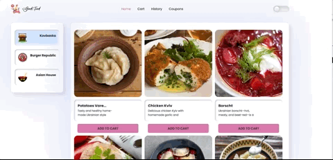
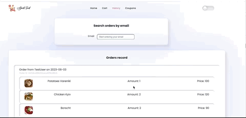

# Good Food Delivery App

Good Food Delivery App is a basic simple prototype of a web-based food ordering service
.
Due to the app was developed as a technical test within a few days, it's functionality is currently limited to a few small features: 
- User can check the list of 3 popular shops and their menus on the Homepage. User can add the selected items to the cart. If any item from the related shop is dropped to the cart, rest of the shop tabs become unactive. 

- User can check his/her shopping cart on the Cart page. User can change quantity or remove a product from the cart. 
Additionaly user can use coupon with special code which can be copied from the Coupons page.
After the order is checked and all form fields are filled, the order can be placed = posted to the remote database.

- User can check the list of all previous orders available in database on the History page. 
The data can be filtered by email field with the special filtering input. 

- User can check the available coupons on the Coupons page in order to use it on the Cart page as it was mentioned before. 


## Demo





## Features

- Intuitive and creative design
- Dark/light mode toggling

## Tech Stack

**Client:** React, Redux + extra libs

**Server:** Node.JS, MongoDB, Express

## Related links

[LINK TO LIVE PAGE](https://iuliia-sokol.github.io/delivery-test/cart)
[LINK TO BACKEND REPO](https://github.com/iuliia-sokol/delivery-test-back)

## Run Locally

Clone the project

```bash
  git clone https://github.com/iuliia-sokol/delivery-test
```

Go to the project directory

```bash
  cd  /name of your local folder/
```

Install dependencies

```bash
  npm install
```

Start the server

```bash
  npm start
```

## Environment Variables

To run this project, you will need to add the following environment variables to your .env.local file

`REACT_APP_BASE_URL_BACK`

`REACT_APP_CAPTCHA_KEY`

`REACT_APP_MAP_API_KEY`

## Authors

The app was designed and developed by Iuliia Sokol.
